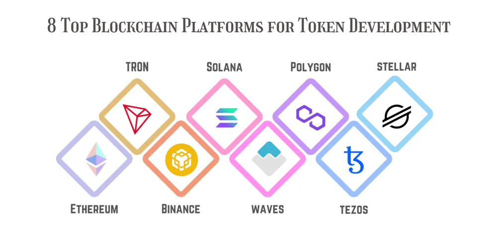

# Tokenizer

>  This README.md explaining my choices I had to make and the reasons why I made these choices.

## **1. Chose a Blockchain plateform**

> First and foremost, i needed to choose a **blockchain platform** that supports the
creation of tokens.

*image from this medium [article](https://medium.com/geekculture/top-5-blockchain-platforms-to-be-considered-for-token-development-7b2c42decdf4)*

I chose **Binance** plateform because :  
  - this subject is the production of a partnership between 42 and BNB Chain
  - looks beginner friendly with tutorials & documentation
  - supports a lot of language like `GO`, `Java`, `Javascript`, `C++,` `C#`, `Python`
  - can use `NodeJS` framwork *like ganache and truffle*
  - EVM (Ethereum Virtual Machine) compatible, support **Ethereum** toolings including **Metamask**, **Remix**

 

  ## **2. token creation**

  >  The code used to create the token is in the *code* folder located at the root of this repository

 

  ## **3. token deployment**

| The smart contract address                |
|-------------------------------------------|
| 0xf737c4F591D9C48B9faD11a4aD90dFC88ac44c09|

  
| The network used | |
| -------------------:| ------------|
|     Network name: | BNB Chain
Network URL: | https://bsc-dataseed.binance.org/  
Chain ID: | 56
Currency symbol:| BNB
Block explorer URL:| https://bscscan.com/

  
| The `test` network used | |
| -------------------:| ------------|
|     Network name: | BNB Chain Testnet
Network URL: | https://data-seed-prebsc-1-s1.binance.org:8545/
Chain ID: | 97
Currency symbol:| tBNB
Block explorer URL:| https://testnet.bscscan.com

To ask tBNB: [https://testnet.binance.org/faucet-smart](https://testnet.binance.org/faucet-smart)
All Bsc RPC [here](https://docs.bnbchain.org/docs/BSCtestnet/)
*see [howToDeployNeopuyo42Token](./deploy/howToDeployNeopuyo42Token.md) for further details*

 

## **4. what Neopuyo42Token represents**

> a clear understanding of how Neopuyo42Token will be used and what
it will represent

Neopuyo42Token is a blockchain currency created for trainning purpose, it has no real representation and is only deployed in a test blockchain environnement. 