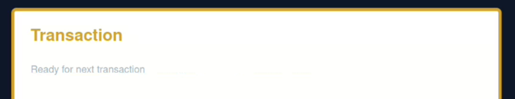
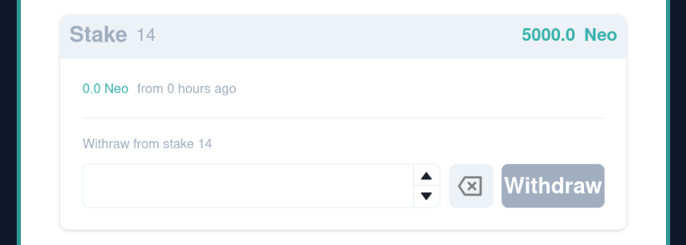

# Neopuyo42 Token project - Overview

> **What are we talking about here ?**  
> The aim of this project is to **deploy** a **token** *called Neopuyo42* on a **blockchain decentralized network**

## Shortcuts
  - [**Project overview**](#project-overview)
  - [**Choices made**](#choices-made)
  - [**Deployment sheet**](#deployment-sheet)
  - [**What Neopuyo42Token represents**](#what-neopuyo42token-represents)
  - [**`Project documentation` table of contents**](./documentation/tokenizerDocumentation.md)

## Project overview

> A demonstration on how can be used the Neopuyo42 token

To highlight the use of the **Neopuyo42 token**, I decided to give **a practical demonstration using a decentralized app**. This was the best way to show in practice some elements of its functioning.

 

### **🔻 Step 1 : run the containers**  

You'll need **Docker** and **Makefile** on your machine to run this project.  
In a console go in `./code/dappNeopuyo42` directory then use the command `make`  

|  Container           | Shared volume    | Content                                     |
| ---------------------| -----------------| ------------------------------------------- |
|  Neopuyo42           | frontend/        | **Hardhat** and **solidity** files  The smart contract is compiled, tested deployed to the Bsc testnet from here |
|  Neopuyo42-frontend  | project/         | The **Dapp** written in Typescript with **ReactJS** and **NextJS**   The dapp display Neopuyo42 token data fetched on the blockchain with the **Metamask wallet** browser extension. See it at [localhost:3000](http://localhost:3000/) |

 

### **🔻 Step 2 : Connect Metamask to Neopuyo42 Dapp**  

| Neopuyo42 Dapp            | Metamask pop-up   |
| ---------------------| -----------------|
|             |        |

**Prerequisites** :  
You need to have Metamask plugin extension installed on your web browser. See this binance [article](https://academy.binance.com/en/articles/connecting-metamask-to-binance-smart-chain) to learn how to install and configure it with Bsc testnet.  

 

### **🔻 Step 3 : Display Neopuyo42 token in Metamask wallet**  

| 1.  | 2.   | 3.   |
| ---| ---| ---|
|   |        |    |
| 1. Click  on `+import tokens`           | 2. Paste Neopuyo42 contract address   | 3. Here the Neopuyo42 tokens |

**Notes** :  
The tokens aren't spawning from nowhere. Here we use the deployer address account. As written in the smart contract the **deployer** is also the **owner** of the token. Here we already **send** and **stake** some tokens, that's why there is a bit less than the 5 billions expecteed at start.

 

### **🔻 Step 4 : Neopuyo42 Dapp presentation**  

| Account panel           | New Stake pannel   |
| ---------------------| -----------------|
|             |        |
| The user can consult his account address,  token balance and total stake amount. | The user can stake some token. The staked amount will be deduced from his balance. See Stake section for further details. |

| Withdraw pannel           | Transaction pannel  |
| ---------------------| -----------------|
|             |        |
| This is a list of all stakes.   At deployment time, the list was empty. The user can withdraw into a stake. If the user withdraw the total amount the stake will be deleted. | When a stake or a withdraw transaction happens, real-time notifications are displayed here. Refer to next sections for further details.   |

 

### **🔻 Step 5 : `Staking` some Neopuyo42 tokens**  

| Let's Stake 5000 NEO  |
| ---  |
|   |

| Metamask pop-up | The created transaction is waiting for confirmation | ---  |
| ---  | ---  | ---  |
|   |  **Transaction**  Each action on the blockchain is done by creating a transaction. This transaction needs to be validated by the blockchain. The process will cost some `gas` to the user asking it. That's why the account need some tBNB tokens. You can ask few for free on Bsc Faucet. |

| Transaction process on Blockchain |
| ---  |
|   |
| User is asked to confirm transaction and its cost.  |
|   |
| Then the transaction is interacting with the blockchain, new blocks are created to seal the deal. |
|   |
| Once the transaction is correctly done, the dapp get back a receipt with the transaction hashcode  |
|   |
| Each transaction follow this principle. Because of the decentralized nature of the blockchain, this will take a relative time to proceed.  |

| Initial balance | After stake |
| ---| ---|
|   |  |
| 5000 token are deduced from account and total supply... | ...creating a new stake increasing the stakes total amount. |

| The new Stake is added in the list |
| ---  |
|   |
| The stake will generate a reward proportional to the elapsed time. The account owner can decide to recover the amount of the stake or part of it. The available reward is directly recovered with a withdrawal. If the withdrawal empties the stake, it is destroyed. |

 

### **🔻 Step 6 : Access all on bsc testnet block explorer**  

Each Account, Smart contract or transaction have an associated **hashcode address**.  
With that address you can publicly access on all data stocked on the blockchained from [https://testnet.bscscan.com](https://testnet.bscscan.com)

| The transaction |
| ---  |
|   |

| The smart contract |
| ---  |
|   |
| You can see all account address owning some Neopuyo42 token. You can send some token straightly from metamask. |
|   |
| If the contract is verified after its deployment, you can access all source code online. See my [deployment section](./deploy/howToDeployNeopuyo42Token.md) for more informations. |

 

[< Go back to top](#neopuyo42-token-project---overview)

 

---

## **Choices made**

**🔻 Blockchain**  

> First and foremost, i needed to choose a **blockchain platform** that supports the
creation of tokens.

*image from this medium [article](https://medium.com/geekculture/top-5-blockchain-platforms-to-be-considered-for-token-development-7b2c42decdf4)*

I chose **Binance** plateform because :  
  - this subject is the production of a partnership between 42 and BNB Chain
  - looks beginner friendly with tutorials & documentation
  - supports a lot of language like `GO`, `Java`, `Javascript`, `C++,` `C#`, `Python`
  - can use `NodeJS` framworks *like ganache and truffle or later hardhat*
  - EVM (Ethereum Virtual Machine) compatible, support **Ethereum** toolings including **Metamask**, **Remix**  
&emsp;  **Ethereum** compatibility looks really nice to a beginner.
&emsp;  The Metamask wallet has a lot of documentation and seems to be the most used one.

**🔻 Token**

To build a **token**, you need to create a **smart contract** written in **solidity**.
Each smart contract is a bit like a `class` with `properties` and `methods`. 

>  You can read the smart contracts used in this project in [the contracts folder](./code/dappNeopuyo42/project/contracts/)

The Ethereum blockchain has and **ERC-20** protocol which can be implemented to build a token.
And because **Binance** is built to be Ethereum-compatible it has its **BEP-20** equivalent interface. 

> To learn more about token creation you can read my [meet new things](./documentation/pages/meet_new_things.md) document.

**🔻 Frameworks**

Once the **smart contract** of your **token** is written, you need some **frameworks** to **compile** it, **test** it and **deploy** it on **local network**, on **test blockchain network** or on **main blockchain network**.  
I firstly tried **ChainIDE** which is a nice way to getting started. Therefore a cloud IDE isn't really what i needed. That's why i chose to continue with **Truffle** and **Ganache**. These two frameworks can easily be used through **npm**. Truffle is responsible of deploying the smart contract and Ganache hold the local server to communicate with the frontend **dapp** part.  
And later, i discovered that the team working on these two projects were migrating to **Hardhat** since september 2023. So i chose to migrate myself to **Hardhat** too, to take advantage of its rich and updated documentation.

> To learn more about the blockchain and its frameworks you can read my [blockchain](./documentation/pages/blockchain.md) document.

 

  ## **Deployment sheet**

| The Neopuyo42 smart contract address                |
|------------------------------------------- |
| 0xd3bc037d57c93ad8ab1d8519049d52a7510cc5fa |

  
| The network used | |
| -------------------:| ------------|
|     Network name: | BNB Chain
Network URL: | https://bsc-dataseed.binance.org/  
Chain ID: | 56
Currency symbol:| BNB
Block explorer URL:| https://bscscan.com/

  
| The `test` network used | |
| -------------------:| ------------|
|     Network name | BNB Chain Testnet
Network URL | https://data-seed-prebsc-1-s1.binance.org:8545/
Chain ID | 97
Currency symbol| tBNB
Block explorer URL| https://testnet.bscscan.com
tBNB FAUCET| [https://testnet.binance.org/faucet-smart](https://testnet.binance.org/faucet-smart)  
All Bsc RPC| [Follow this link](https://docs.bnbchain.org/docs/BSCtestnet/)  

> Go to [how To deploy Neopuyo42 token](./deploy/howToDeployNeopuyo42Token.md) for further deployment details

 

## **What Neopuyo42Token represents**

> How Neopuyo42Token will be used and what
it will represent

| Neopuyo42 Token             |                                 |
| ----------------------------| --------------------------------|
|  Nature                     | Blockchain Currency             |
|  Ticker                     | NEO                             |
|  Maximum supply             | 5 000 000 000 NEO               |
|  Decimals                   | 18                              |
|  Blockchain explorer        |  [bscscan testnet](https://testnet.bscscan.com)     |
|  Smart contract address     |  0xd3bc037d57c93ad8ab1d8519049d52a7510cc5fa         |
|  Deployer(Owner) address    |  0x8C3df1154F9f019379e549652cb3f11768438415         |

Neopuyo42Token is a blockchain currency created for trainning purpose, it is only deployed in a test blockchain environnement the **Bsc testnet**.  
A **decentralized application** build with ReactJS is here to demonstrate how you can interact with the token. The dapp will retrieve the **contract transactions** on the testnet blockchain and will be able to **read** the token data, or to **write** new transactions on the blockchain.

For exemple you can **stake** some token. Staking is a major part of currency and the staked amount is essentially a **pledge** to support the network. By staking their tokens, users can earn rewards for participating in the validation of transactions on the blockchain. This process helps to secure the network and ensure its integrity, while also providing an opportunity for token holders to earn passive income.

> Has a demonstration about staking and withdrawing Neopuyo42 token, you can read the [overview](#project-overview) part at top of this ReadMe.